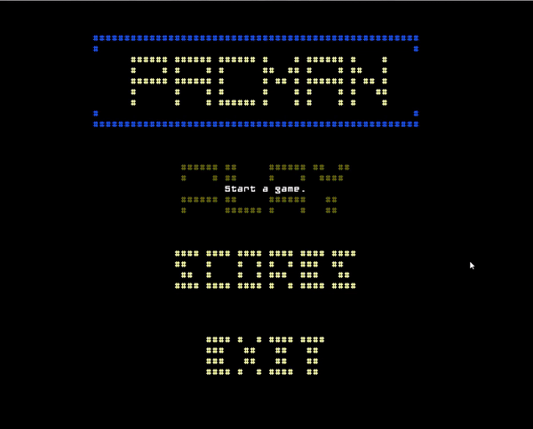

## LDTS_T10G01 - Pac-Man

- This project consists in a remake of Pac-Man, the popular arcade game published in the eighties, while trying to fully implement all the features and mechanics from the original game.
- It comes with different levels that suit the small, but functional range of difficulties it has to offer, just so one can see the difference between them  gameplaywise.
- The player is expected to collect all the pellets (white dots) while avoiding all the ghosts that continuously pursue you.
- It was developed by:
  - *Nuno Jesus* (*up201905477*@up.pt)
  - *Miguel Silva* (*up202007972*@up.pt)
  - *Carlos Veríssimo* (*up201907716*@up.pt)

### IMPLEMENTED FEATURES

- **Collect Pac-Dots** - The playable character is able to collect Pac-Dots.
- **Collect Power-Ups** - The playable character is able to collect Power-Ups.
- **Pac-Man Movement** - The player can manipulate Pac-Man's position with keyboard arrows.
- **Pac-Man Power-Up** - 'Eating' one of these Power-Ups will turn Pac-Man into an invincible
  monster, and naturally scare the Ghosts away!
- **Gates** - When the player reaches a gate (or tunnel), they are transported to the other side
  of said gate.
- **Wall Colliding** - When the player tries to run into one of the maze's walls, the game sets
  Pac-Man's position to the one it was before, blocking his attempt.
- **Ghost Searching** - The hostile ghosts move towards Pac-Man, tracking its position and
  following it. On the other hand, when they're scared, these ghosts do the opposite,
  evaluating its position once again, but choosing to avoid it.
- **Pacman was eaten by a ghost** - When the pacman gets too close to an hostile ghosts, the 
game ends, since it was eaten. That does not happen if the ghost in question is a scared one.
- **Self-movement** - The playable character should have its own movement. The player should be
  able to manipulate only the direction of the movement.
- **Reverting Ghosts** - After their transformation into 'Scared Ghosts', these ghosts should be
  able to return to their original state.
- **High-Score System** - After playing the game, the points that you've scored should be
  registered in a leaderboard, so you can compete with your best results.
- **Menu** - When the user runs the game, they will be prompt with a simple menu where they can
  either start playing, consult previous scores or exit the game.
- **Level continuity** - If the player wins the current level, they are automatically redirected to the next level. 
If they complete the last level(5), the game will end. 

 
### HOW IT LOOKS (28/01/2022)

[Watch the video](https://youtu.be/iaSibdP7F_U)
