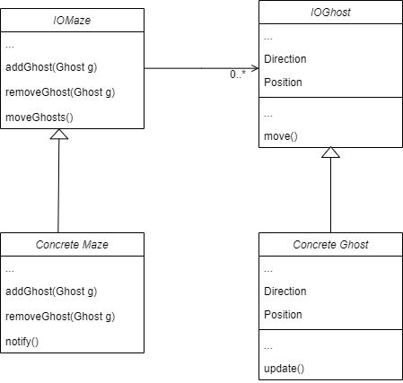
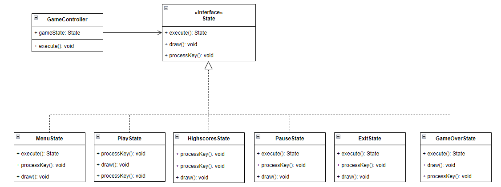
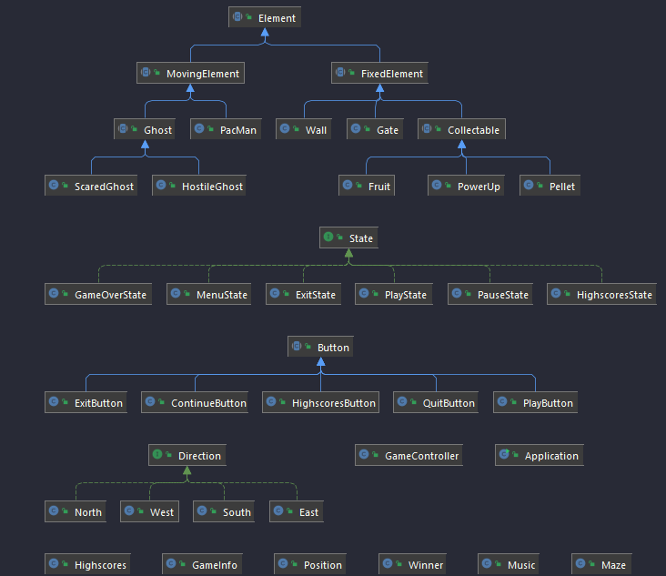
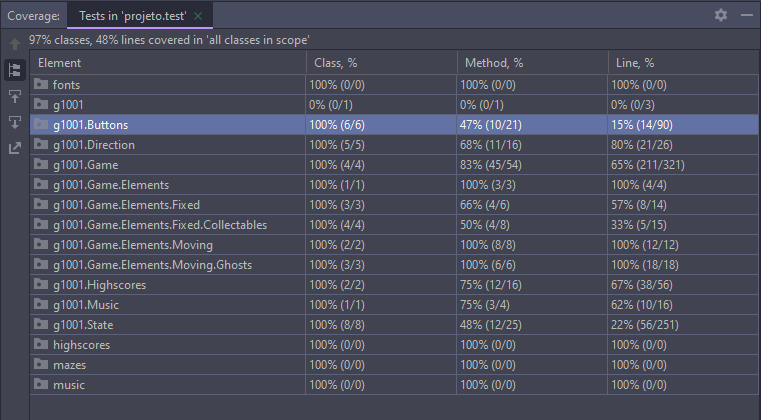
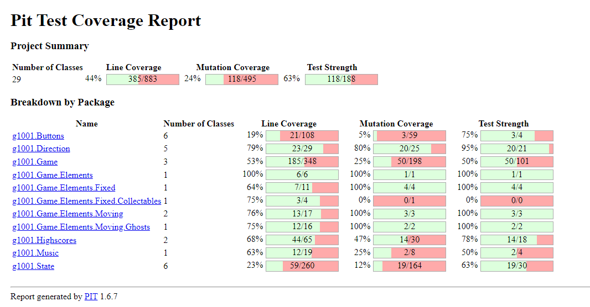
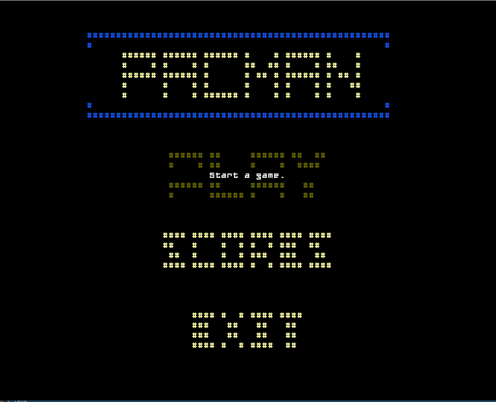
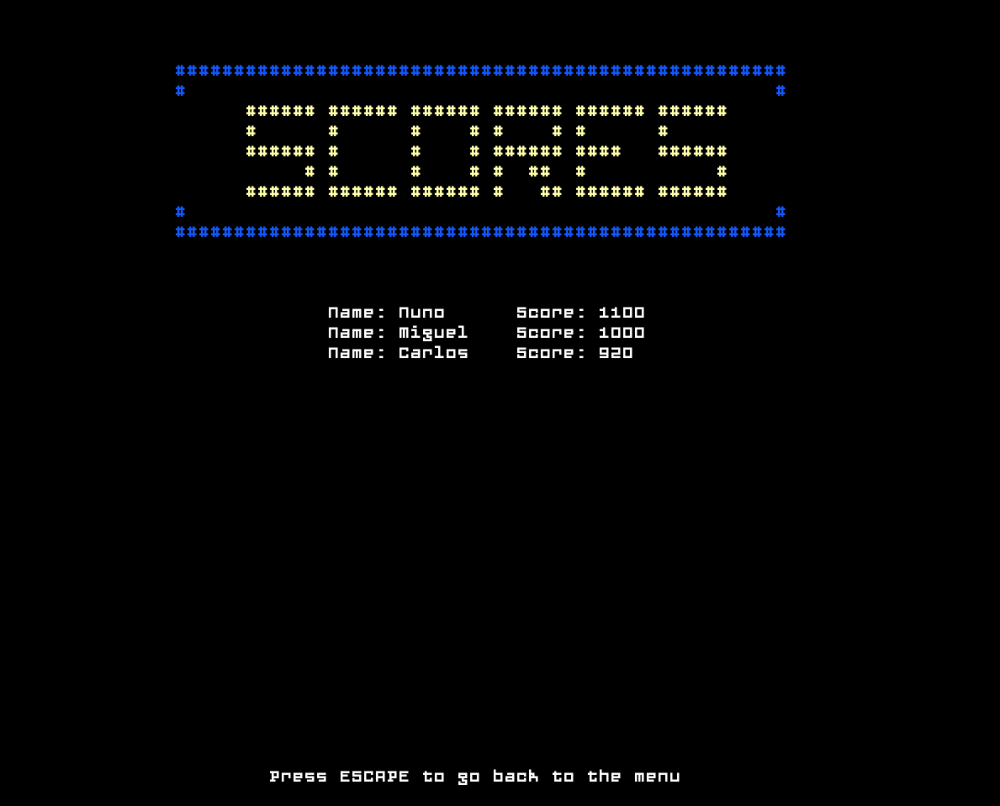
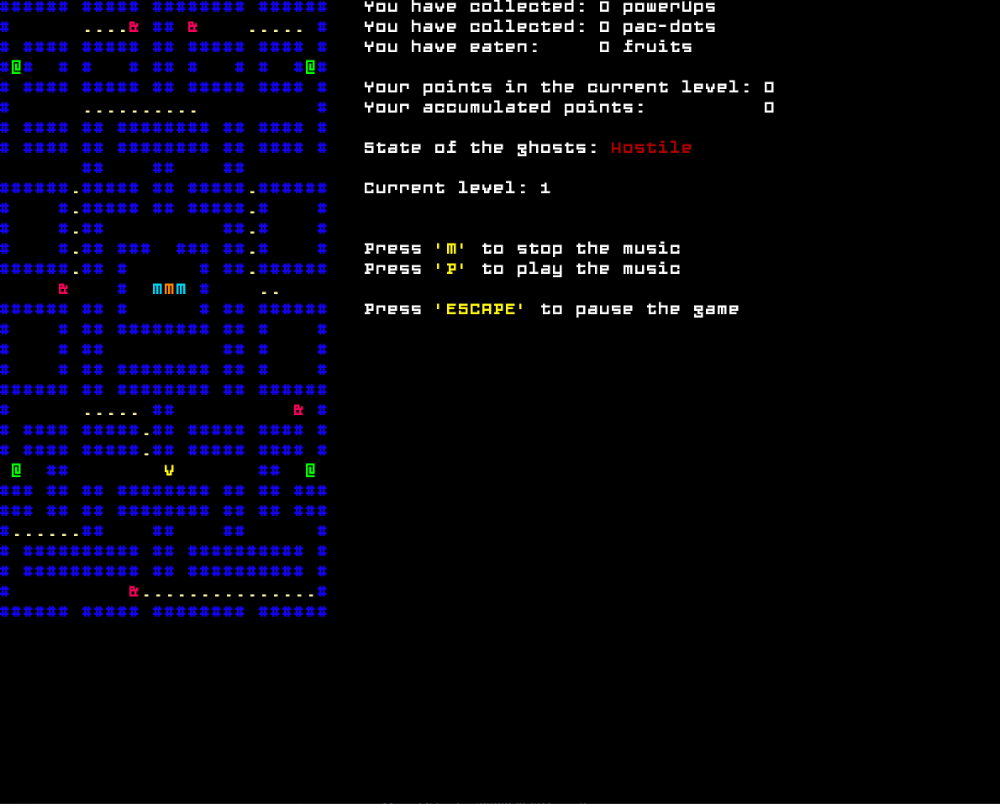
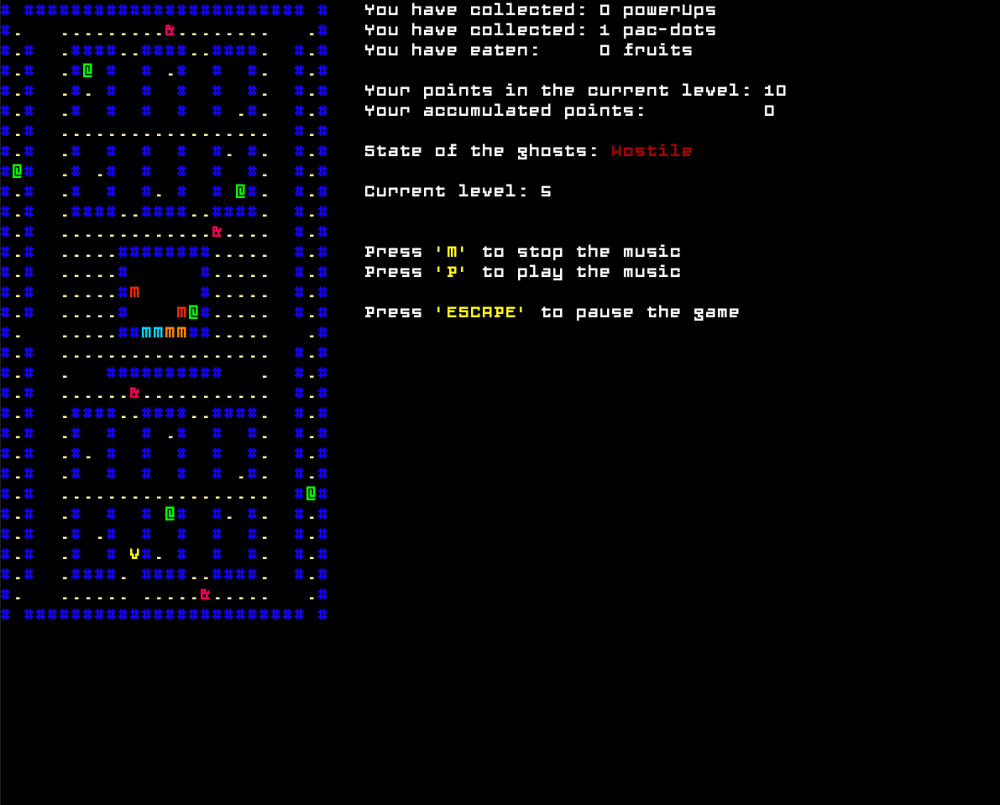
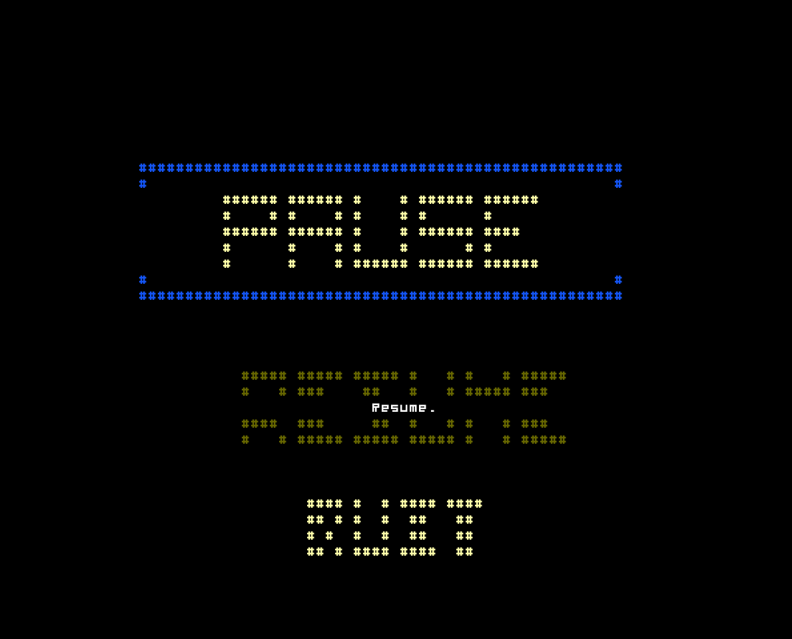

## LDTS_1001 - PAC-MAN

- This project consists of a remake of Pac-Man, the popular arcade game published in the eighties, while keeping all the features and mechanics from the original game.
- It comes with different levels that suit the small, but functional range of difficulties it has to offer, just so one can see the difference between them gameplaywise.
- The player is expected to collect all the pellets (white dots) while avoiding all the ghosts that continuously pursue them.
- It was developed by:
  - *Carlos Veríssimo* (*up201907716*@up.pt)
  - *Miguel Silva* (*up202007972*@up.pt)
  - *Nuno Jesus* (*up201905477*@up.pt)
  

### IMPLEMENTED FEATURES

- **Collect Pac-Dots** - The playable character is able to collect Pac-Dots to gain points.
- **Collect Power-Ups** - The playable character is able to collect Power-Ups.
- **Collect Fruits** - The playable character is able to collect Fruits to gain points.
- **Pac-Man Movement** - The player can manipulate Pac-Man's direction with keyboard arrows.
- **Pac-Man Power-Up** - 'Eating' one of these Power-Ups will turn Pac-Man into an invincible
  monster, and naturally scare the Ghosts away!
- **Gates** - When the player reaches a gate (or tunnel), they are teleported to its parallel gate.
- **Wall Colliding** - When the player tries to run into one of the maze's walls, the game sets
  Pac-Man's position to the one it was before, blocking their attempt.
- **Ghost Searching** - The hostile ghosts move towards Pac-Man, tracking its position and
  following it. On the other hand, when they're scared, these ghosts do the opposite,
  evaluating its position once again, but choosing to avoid it.
- **Eating Pacman** - When the Pacman gets too close to a hostile ghost, the 
game ends, since it was eaten. That does not happen if the ghost in question is a scared one.
- **Self-movement** - The playable character has its own movement. The player is only able to manipulate its direction.
- **Reverting Ghosts** - After their transformation into 'Scared Ghosts', these ghosts are
  able to return to their original state.
- **High-Score System** - After playing the game, the points that you've scored are
  registered in a leaderboard, so you can compete with your best results.
- **Menu** - When the user runs the game, they are prompt with a simple menu where they can
  either start playing, consult previous scores or exit the game. 
- **Level continuity** - If the player wins the current level, they are automatically redirected to the next. 
If one completes the last (level 5), the game ends. 
- **Music** - Music feature is implemented and it will start playing when you press the 'play' button. It won't play on
menus or when the game is paused. It can also be toggled off while playing.

### WHENEVER PAC-MAN MOVES, ALL GHOSTS SHOULD TAKE A STEP IN ITS DIRECTION

**Problem in Context**

For the game to be functioning properly, there was the need to make a somewhat sensible AI.
To do so, we needed to find a way to update every Ghost on the maze at once, whenever Pac-Man 
moved and follow him in case he's vulnerable. With that said, we found a particular pattern to 
make the most sense.

**The Pattern**

We have applied the **Observer** pattern. This pattern allowed us to implement a subscription 
mechanism to notify multiple objects about any events that happen to the object they’re observing,
which is none other than Pac-Man, in this particular example. By implementing this pattern we found 
a straight-forward solution that fits our needs: moving every single observer, whenever Pac-Man 
moves. If we were to update the Ghosts one by one as separate instances without the existence of 
any type of connection between them, it would be easy to make mistakes such as updating Ghosts 
that have already been eaten or forgetting to move Ghosts that should be looking for Pac-Man.

**Implementation**

The following figure shows how the pattern’s roles were mapped to the application classes.

These classes can be found in the following files:

- [Ghost](../src/main/java/g1001/Game/Elements/Moving/Ghosts/Ghost.java)
- [Maze](../src/main/java/g1001/Game/Maze.java)

**Consequences**

The use of the Observer Pattern in the current design allows the following benefits:

- We can notify all the various objects that are dependent on Pac-Man's movement at once.
- We can now remove and add elements to the ghosts lists without the need to refactor our code, 
as the 'update' method operates on each and every element stored in the list (while being 
independent of its size or content).
- We can split our 'observers' into two groups: **Scared** ghosts and **Hostile** ones. By doing so, 
we can manage them more precisely, and command them accordingly.

### WHEN I LOAD THE GAME WHERE DO I GO

**Problem in Context**

In order to have a functional main menu, we implemented logic that allows the 
player to move between different screens and options based on their input. We found the _State 
Pattern_ to be the most suitable for the intended functionality.

**The Pattern**

We used the **State** pattern to allow the navigation mentioned above. Creating an 
interface called State as well as several subclasses that implement the said class. The subclasses 
are, in their true form, the state that the game is currently in.

**Implementation**

The following figure shows how the pattern’s roles were mapped to the application classes.

These classes can be found in the following files:

- [GameController](../src/main/java/g1001/Game/GameController.java)
- [State](../src/main/java/g1001/State/State.java)
- [MenuState](../src/main/java/g1001/State/MenuState.java)
- [PlayState](../src/main/java/g1001/State/PlayState.java)
- [HighscoresState](../src/main/java/g1001/State/HighscoresState.java)
- [PauseState](../src/main/java/g1001/State/PauseState.java)
- [ExitStateState](../src/main/java/g1001/State/ExitStateState.java)
- [GameOverState](../src/main/java/g1001/State/GameOverState.java)

**Consequences**

The use of the State Pattern in the current design allows the following benefits:

- By dividing the code into different State Classes, we prevent packing the **GameController** Class with large conditionals that, depending on an attribute specifying the state the game is currently in, would change the behaviour of the overall execution.

- Also, because a GUI needs to be constantly displayed and the user input processed, the **State** interface is built with, not only a method in charge of executing the state indefinitely (**execute**() method), but also with 2 methods up to the tasks mentioned first. Bypassing this pattern would mean 90% of each method to be written 3 times in a single file, regardless of different outcomes.

### CLASS DIAGRAM

### CODE SMELLS

#### BLOATERS - LARGE CLASS

It's not the only one, but sure is a good example: our **Maze** class has too many attributes, methods and, therefore, too many lines of code. Surely some of its attributes and corresponding methods could have been clipped from it and transfered to a new class. 

#### DISPENSABLES

In our implementation of the different program states, we have to draw the GUI. To do so, we created a **draw** method for each State class
that follows the exact same structure in each and every State class: we make use of about 8 lines to draw a string to assemble the menu GUI.  Instead, we could have taken the strings into a bi-dimensional array and extracted the draw method into the GameController class. Therefore, it would have been a matter of only getting the both the string matrix and the buttons array from the state in the draw method. 

Other than that, our _**moveScaredGhosts**_ and _**moveHostileGhosts**_ methods in the  [Maze Class](../src/main/java/g1001/Game/Maze.java) contain 
too many lines of code, which may also be considered a code smell. 

#### COUPLERS - FEATURE ENVY
The way our ghosts move is controlled by Maze's methods single-handedly. We could have avoided that by
implementing the **Strategy Pattern** and making ghosts move based on their strategy (fleeing in case they were scared
and, chasing if they felt confident). This could have been refactored using **Move** and **Extract** methods.

### TESTING

There was a warning after running **ERRORPRONE** related to the use of the method [*String.split()*](https://errorprone.info/bugpattern/StringSplitter) because it leads
to surprising behaviour. ERRORPRONE suggested we use a different method, however it did not work as expected so we used an annotation to suppress that warning. Other than that,
it did not detect any error or any other warnings whatsoever.

#### Better Code Hub

In order to balance the architecture components, we had to increase the zoom level to 5 which had a side effect leading us to have some loose architecture components.

#### Test Coverage

#### Pitest

[Full Pitest Report](../docs/pitest/)

### HOW TO PLAY THE GAME

- Use `ArrowUp` or `ArrowDown` to move through the different options in menus, then choose your option by pressing `ENTER`.
- Use `ArrowUp/ArrowRight/ArrowDown/ArrowLeft` to control the Pacman's movement.
- Use `ESCAPE` to pause the game.
- Use `m` to mute the music or `p` to unmute it (By default, the music is unmuted).

### PREVIEWS

#### Main Menu

#### Highscores

#### Level 1

#### Level 5

#### Pause

### SELF-EVALUATION

Throughout the development of this project, every group member did their best to attend our online stand-ups,
develop the parts of code that were assigned to them, and inspect and test the other colleagues implemented features.
By doing so, everyone worked just as one would expect them to, and the whole process ran smoothly!

- Nuno Jesus: 30%
- Miguel Silva: 34%
- Carlos Veríssimo: 36%

PS: You can change the music by heading to the [PlayState](../src/main/java/g1001/State/PlayState.java) class and changing the argument of the Music constructor (Line 27) to either one of these options: 
- `"/music/Pacman.wav"`
- `"/music/Chill.wav"`

